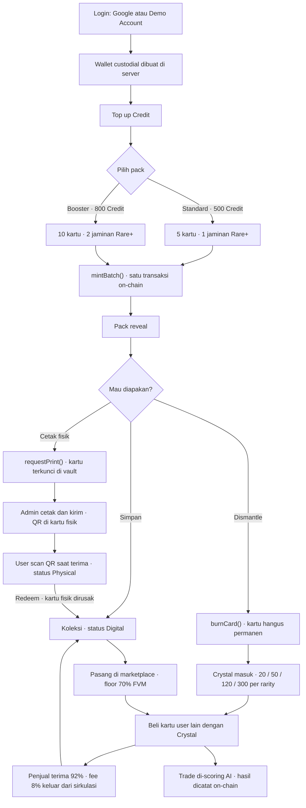
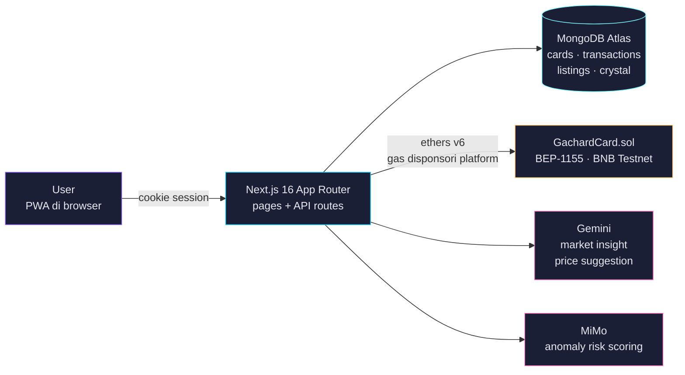
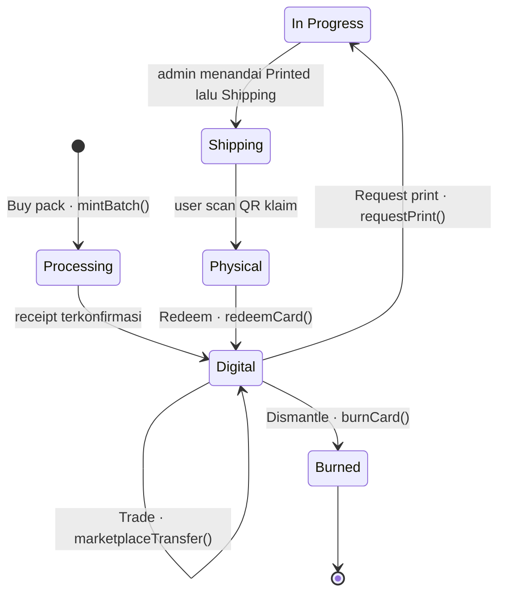
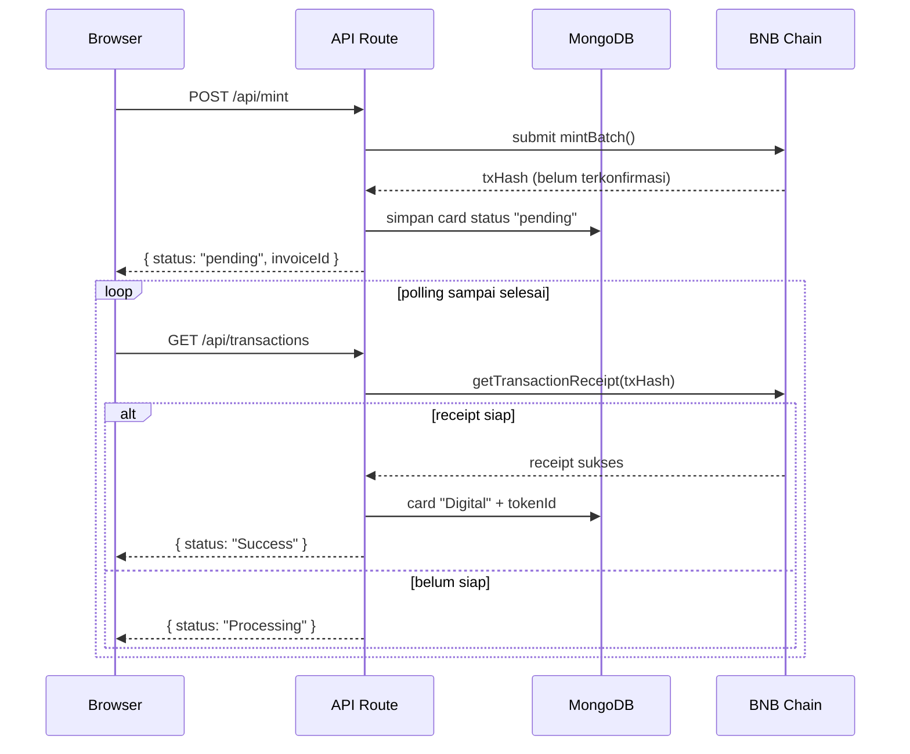

# Gachard

Platform TCG digital-native di mana brand/IP dapat menerbitkan kartu (Battle Card / Collection Card) yang bisa dibeli, dikoleksi, dicetak fisik, dan ditukar kembali ke digital — dengan blockchain yang sepenuhnya tersembunyi dari user.

Dibangun untuk submission **Indonesia Web3 Hackathon 2026** (track Consumer Apps, BNB Chain).

## Live Demo

- **App**: https://www.gachard.com
- **Demo video**: https://www.youtube.com/watch?v=DH03_a2wL40
- **Admin Console**: https://www.gachard.com/admin (dilindungi Basic Auth)
- **Smart Contract**: [`0x3E1Cf18D…87d4` di BscScan Testnet](https://testnet.bscscan.com/address/0x3E1Cf18D6b94A4aCC438176b87E1387280aC87d4)

## Untuk Juri — Coba Sendiri dalam 5 Menit

Tidak perlu wallet, tidak perlu akun Google, tidak perlu testnet faucet.

1. Buka https://www.gachard.com/login lalu klik **Demo Account**. Satu wallet custodial BNB
   Testnet dibuat di server untuk Anda, tanpa seed phrase dan tanpa dialog wallet apa pun.
2. Masuk ke **Top Up**, tambahkan credit. Pembayaran di build hackathon ini **disimulasikan**,
   jadi tidak ada kartu kredit yang diminta.
3. **Buy Pack** di halaman Collect. Pilih Standard (5 kartu) atau Booster (10 kartu). Satu pack
   di-mint sebagai satu transaksi `mintBatch()` di BNB Testnet.
4. Buka **Collection**, pilih satu kartu, lalu coba salah satu: **Dismantle** untuk membakar
   kartu secara permanen on-chain dan menerima Crystal, atau **Sell** untuk memasangnya di
   marketplace dengan harga berpanduan FVM.
5. Buka **Profile → Transaction History**. Setiap transaksi punya txHash yang bisa dibuka
   langsung ke BscScan. Di situlah bukti bahwa semua ini benar-benar on-chain, bukan basis data
   biasa yang diberi label blockchain.

Yang perlu diperhatikan saat mencoba: **tidak ada satu pun istilah wallet, token, gas, atau
on-chain yang muncul di UI**. Itu disengaja dan merupakan premis produknya (ADR-002). Seluruh
istilah teknis hanya hidup di Admin Console dan di BscScan.

## User Flow



## Status Fitur (jujur, per 21 September 2026)

| Fitur | Status |
|---|---|
| Login, wallet custodial, gas disponsori | Jalan di produksi |
| Buy pack, mint on-chain, reveal | Jalan di produksi |
| Print request, vault lock, claim QR, redeem | Jalan di produksi |
| Dismantle dan Crystal | Jalan di produksi |
| Marketplace: listing, buy, cancel, FVM floor, fee 8% | Jalan di produksi |
| AI Anomaly Detection Oracle (MiMo, dicatat on-chain) | Jalan di produksi |
| AI market insight dan price suggestion (Gemini) | **Mati sementara** — Gemini API belum diaktifkan di GCP project |
| Pembayaran (top up credit dan biaya cetak) | **Disimulasikan** — belum ada payment gateway |
| AI vision untuk verifikasi visual kartu | **Ditunda** (ADR-022), verifikasi memakai QR lookup on-chain |

## Fitur Utama

### Core Loop
- **Login** — Google OAuth + demo account (custodial wallet, tersembunyi dari user)
- **Buy Pack** — Standard (5 kartu / 500 Credit, 1 jaminan Rare+) atau Booster (10 kartu / 800 Credit, 2 jaminan Rare+)
- **Collect** — Kartu NFT di-mint ke blockchain, disimpan di collection user
- **Print** — Cetak kartu fisik (+$14.99 shipping), kartu terkunci di vault
- **Claim Shipping** — User scan QR code saat terima kartu fisik → status "Physical"
- **Redeem** — Masukkan Card ID + Redeem Code dari kartu fisik → kembali ke digital

### Fitur Lainnya
- **Scan & Verify** — Scan QR code untuk verifikasi keaslian kartu
- **Credit System** — Top up credit untuk beli pack
- **Transaction History** — Riwayat semua transaksi di Profile page
- **Unique Card ID** — Setiap kartu punya ID hex unik (e.g. `#8a866`)
- **Invoice ID** — Setiap transaksi punya Invoice ID (e.g. `GC-20260730-a3f1`)
- **Admin Console** — Manage users, transactions, cards, print requests
- **Trade Marketplace** — Jual beli kartu antar user dengan Crystal, harga dipandu FVM (Fair Value Market), fee 8%
- **Dismantle & Crystal** — Burn kartu untuk mendapatkan Crystal currency
- **AI Anomaly Detection** — Deteksi wash-trading pada marketplace, hasilnya dicatat on-chain (Oracle)
- **Become a Creator** — Form whitelist untuk IP owner di `/creators`
- **Support Gachard** — Floating CTA button untuk early supporters

## Quick Start

### Prerequisites
- Node.js 18+
- MongoDB Atlas account (free tier)
- Google Cloud Console OAuth credentials

### Frontend + Backend (Single Service)
```bash
cd frontend
npm install
npm run dev
```

Backend berjalan lewat Next.js API routes (`app/api/`) — tidak ada service terpisah.

### Smart Contracts (Foundry)
```bash
cd contracts
forge install
forge build
forge test
```

### Environment Variables
Lihat `frontend/.env.local.example`.

## Stack

| Layer | Technology |
|-------|-----------|
| Frontend | Next.js 16 (App Router), React 19, Tailwind CSS 4 |
| Backend | Next.js API Routes (single service) |
| Database | MongoDB Atlas (free tier) |
| Blockchain | BNB Chain Testnet, BEP-1155 |
| Smart Contracts | Solidity 0.8.24, Foundry, OpenZeppelin v5 |
| Wallet | Custodial (ethers.js v6), sponsored gas |
| Auth | Google OAuth + demo accounts |
| Payment | Disimulasikan (belum ada integrasi Stripe sungguhan) |
| AI | MiMo V2.5 Pro (risk scoring), Gemini API (market insight + price suggestion) |
| Hosting | Vercel (frontend + backend), Vercel Edge |

## Architecture

### System Overview

Satu service Next.js menangani frontend dan backend sekaligus (ADR-017). Blockchain, AI,
dan database semuanya diakses dari API routes — tidak pernah dari browser, sehingga wallet
custodial dan private key tidak pernah menyentuh client.



### Card Lifecycle

Inti produknya: satu kartu, satu token ID, seumur hidupnya. Cetak fisik **mengunci** kartu di
vault — bukan burn-and-remint — sehingga provenance tidak pernah terputus (ADR-004).



Catatan:

- **Trade** memindahkan kepemilikan tanpa mengubah status — kartu tetap `Digital`.
- **In Progress** memayungi tiga tahap fulfillment internal: `Locked` → `Processing` → `Printed`.
  Saat `requestPrint()`, NFT benar-benar berpindah ke alamat kontrak (vault) dan transfer diblokir.
- **Physical** berarti kartu fisik sudah di tangan user. Redeem mengembalikannya ke digital dengan
  syarat kartu fisiknya dirusak permanen.
- **Burned** adalah status terminal — token dihancurkan on-chain, tapi record-nya tetap disimpan
  supaya riwayatnya masih bisa ditelusuri lewat Scan (ADR-026, ADR-028).

### Pola Async untuk Transaksi Blockchain

Endpoint tidak pernah menunggu receipt on-chain, karena batas waktu function Vercel akan
memotongnya di tengah jalan dan membuat refund ter-skip. Semua POST langsung mengembalikan
`pending`, lalu frontend polling (ADR-018).



### Key Design Decisions
- **ADR-002**: Wallet custodial, tersembunyi dari user
- **ADR-003**: Gas fee disponsori platform
- **ADR-004**: Lock in-place via status flag (bukan burn)
- **ADR-017**: Next.js API routes sebagai satu-satunya backend
- **ADR-018**: Async pattern untuk transaksi blockchain
- **ADR-020**: AES-256-GCM encryption untuk private key
- **ADR-024**: Marketplace fungsional (trade system)
- **ADR-025**: AI Anomaly Detection Oracle
- **ADR-026**: Dismantle & Crystal (burn-to-earn)
- **ADR-027**: Become a Creator (whitelist form)
- **ADR-028**: Status terminal kartu — klaim atomik + guard anti-timpa
- **ADR-029**: Tool development pindah ke Claude Code

Lihat `DECISIONS.md` untuk semua ADR (001–029).

### Project Structure
```
Gachard/
├── frontend/           # Next.js app (single service)
│   ├── app/           # Pages & API routes
│   ├── components/    # React components
│   ├── lib/           # Utilities & blockchain
│   ├── hooks/         # React hooks
│   └── public/        # Static assets
├── contracts/         # Solidity smart contracts (Foundry)
├── docs/              # Documentation
│   └── 00-project-overview.md
├── CLAUDE.md          # Contributor rules & invariants
├── DECISIONS.md       # Architecture decisions (ADR-001 s/d ADR-029)
├── PRD-Gachard-Hackathon.md  # Product Requirements Document
└── vercel.json        # Vercel deployment config
```

## Deployment

### Vercel
1. Push ke `main` branch → auto-deploy
2. Settings:
   - Framework Preset: Next.js
   - Root Directory: `frontend`
3. Environment Variables:
   - `MONGODB_URL` — MongoDB Atlas connection string
   - `DATABASE_NAME` — gachard
   - `GOOGLE_CLIENT_ID` — Google OAuth Client ID
   - `GOOGLE_CLIENT_SECRET` — Google OAuth Client Secret
   - `CONTRACT_ADDRESS` — Smart contract address
   - `ADMIN_WALLET_ADDRESS` — Admin wallet address
   - `ADMIN_PRIVATE_KEY` — Admin wallet private key
   - `BSC_TESTNET_RPC` — BNB Testnet RPC URL
   - `ENCRYPTION_SECRET_KEY` — AES-256-GCM key (min 32 chars)
   - `ADMIN_USERNAME` / `ADMIN_PASSWORD` — Admin console credentials
   - `CHAIN_ID` — 97 (BNB Testnet)
   - `NEXT_PUBLIC_CONTRACT_ADDRESS` — Contract address untuk client-side
   - `GEMINI_API_KEY` — Market insight + price suggestion
   - `MIMO_API_KEY` / `MIMO_BASE_URL` — AI risk scoring (anomaly detection)

### Database Scripts
```bash
# Clean slate (hapus semua data testing)
cd frontend && npx tsx scripts/clean-slate.ts
```

## Development Workflow
1. Baca `DECISIONS.md` — keputusan arsitektur yang sudah dikunci (ADR-001 s/d ADR-029)
2. Baca `docs/00-project-overview.md` — problem, solution, scope
3. Baca `CLAUDE.md` — invarian yang gampang dilanggar
4. Baca `PRD-Gachard-Hackathon.md` — PRD lengkap (historis; lihat blok Amendments)
5. Jangan menyimpang dari `DECISIONS.md` tanpa mencatat ADR baru

Sprint 1–6 sudah selesai; catatan sprint dan laporan sesi disimpan di luar repo.
Tool development saat ini: **Claude Code** (ADR-029).

## Blockchain Verification
Semua transaksi blockchain dapat diverifikasi di BSCScan:
- **Smart Contract**: `0x3E1Cf18D6b94A4aCC438176b87E1387280aC87d4` (AI Anomaly Detection Oracle)
- **Admin Wallet**: `0x3F4CBDCb5bFb014d63C07400DcD11513DB5F7b56`
- **Chain**: BNB Testnet (Chain ID 97)
- **Explorer**: https://testnet.bscscan.com

Admin Console (https://www.gachard.com/admin) menampilkan:
- Semua transaksi dengan txHash yang bisa diklik ke BSCScan
- Wallet address setiap user
- Token ID setiap kartu di blockchain
- Risk score dari AI anomaly detection

## Catatan untuk AI Coding Agent
- Baca `CLAUDE.md` dan `DECISIONS.md` sebelum membuat perubahan
- Jangan gunakan istilah blockchain/crypto/on-chain di UI user-facing
- Semua perubahan harus kompatibel dengan ADR yang sudah dikunci
- Test di mobile (iPhone 12 Pro/390px, Galaxy S8+/360px) sebelum deploy — ada blok budget performa mobile di `app/globals.css`
- Gunakan `getAuthenticatedUser(req)` untuk semua API routes (server-side session)
- Semua transaksi blockchain menggunakan pola async (ADR-018)
- Rekonsiliasi tidak boleh menimpa status terminal seperti `Burned` (ADR-028)
- `tokenId` tidak unik lintas kontrak — query kartu pakai `cardId`

## License
Private — Indonesia Web3 Hackathon 2026 submission.
