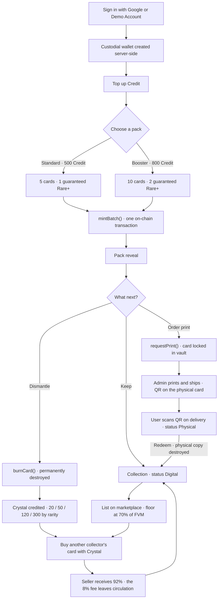
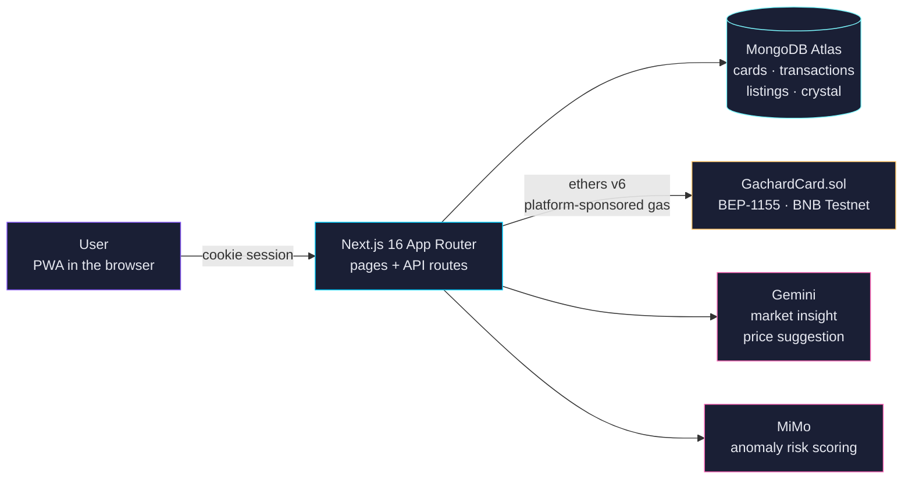
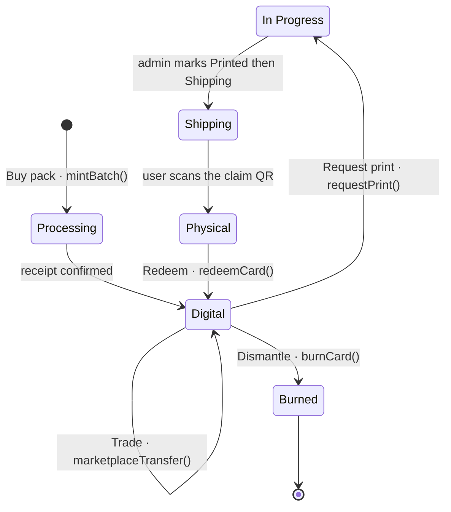
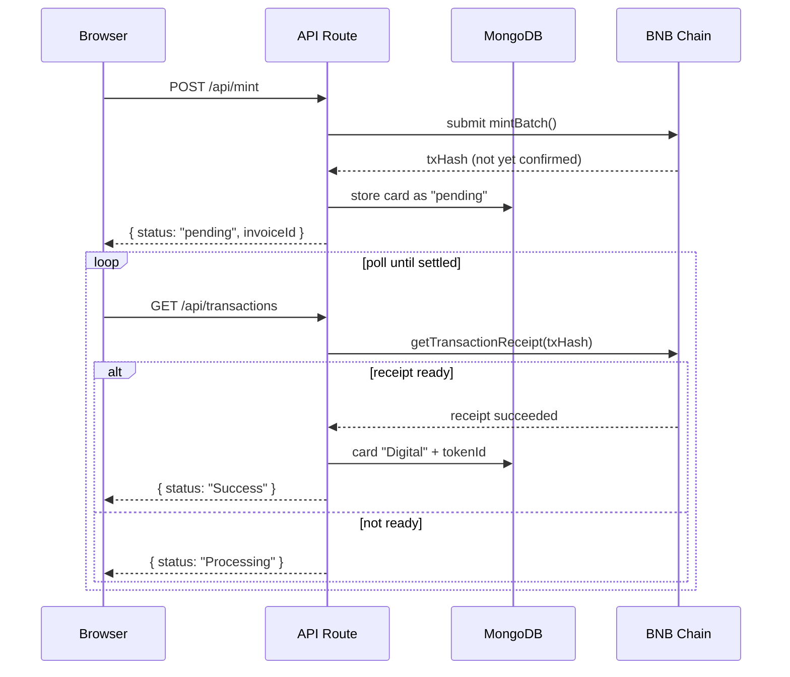

# Gachard

A digital-native TCG platform where brands and IP owners issue cards (Battle Card / Collection Card) that can be bought, collected, printed as physical copies, and redeemed back to digital, with the blockchain kept entirely out of the user's way.

Built for the **Indonesia Web3 Hackathon 2026** submission (Consumer Apps track, BNB Chain).

## Live Demo

- **App**: https://www.gachard.com
- **Demo video**: https://www.youtube.com/watch?v=DH03_a2wL40
- **Admin Console**: https://www.gachard.com/admin (Basic Auth protected)
- **Smart Contract**: [`0x3E1Cf18D…87d4` on BscScan Testnet](https://testnet.bscscan.com/address/0x3E1Cf18D6b94A4aCC438176b87E1387280aC87d4)

## For Reviewers: Try It in 5 Minutes

No wallet, no Google account, and no testnet faucet required.

1. Open https://www.gachard.com/login and click **Demo Account**. A custodial BNB Testnet wallet
   is generated server-side for you, with no seed phrase and no wallet dialog.
2. Go to **Top Up** and add credits. Payments in this hackathon build are simulated, so no card
   details are requested.
3. **Buy Pack** on the Collect page. Choose Standard (5 cards) or Booster (10 cards). Each pack is
   minted as a single `mintBatch()` transaction on BNB Testnet.
4. Open **Collection**, pick a card, then try either **Dismantle**, which burns the card
   permanently on-chain and pays out Crystal, or **Sell**, which lists it on the marketplace at an
   FVM-guided price.
5. Open **Profile → Transaction History**. Every transaction carries a txHash that links straight
   to BscScan. That is where you can confirm the state changes are genuinely on-chain rather than
   database rows labelled as blockchain.

One thing worth watching while you test: the interface never uses the words wallet, token, gas or
on-chain. That is deliberate and it is the premise of the product (ADR-002). Technical vocabulary
appears only in the Admin Console and on BscScan.

## User Flow



## Feature Status (as of 21 September 2026)

| Feature | Status |
|---|---|
| Sign-in, custodial wallet, sponsored gas | Live in production |
| Buy pack, on-chain mint, reveal | Live in production |
| Print request, vault lock, claim QR, redeem | Live in production |
| Dismantle and Crystal | Live in production |
| Marketplace: listing, buy, cancel, FVM floor, 8% fee | Live in production |
| AI Anomaly Detection Oracle (MiMo, recorded on-chain) | Disabled via the `ENABLE_AI` flag (ADR-030) |
| AI market insight and price suggestion (Gemini) | Disabled via the `ENABLE_AI` flag (ADR-030) |
| Payments (credit top-up and print fees) | Simulated; no payment gateway integrated |
| AI vision for visual card verification | Deferred (ADR-022); verification uses on-chain QR lookup |

## Features

### Core Loop
- **Sign in** — Google OAuth and demo accounts, each with a custodial wallet hidden from the user
- **Buy Pack** — Standard (5 cards / 500 Credit, 1 guaranteed Rare+) or Booster (10 cards / 800 Credit, 2 guaranteed Rare+)
- **Collect** — Cards are minted on-chain and stored in the user's collection
- **Print** — Order a physical copy (+$14.99 shipping); the card is locked in the vault
- **Claim Shipping** — The user scans the QR code on delivery and the card shows as "Physical"
- **Redeem** — Enter the Card ID and Redeem Code from the physical copy to return it to digital

### Additional Features
- **Scan & Verify** — Scan a QR code to verify a card's authenticity
- **Credit System** — Top up credits to buy packs
- **Transaction History** — Every transaction listed on the Profile page
- **Unique Card ID** — Each card carries a unique hex ID (e.g. `#8a866`)
- **Invoice ID** — Each transaction carries an invoice ID (e.g. `GC-20260730-a3f1`)
- **Admin Console** — Manage users, transactions, cards and print requests
- **Trade Marketplace** — Peer-to-peer trading priced in Crystal, guided by FVM (Fair Value Market), with an 8% fee
- **Dismantle & Crystal** — Burn a card to earn Crystal
- **AI Anomaly Detection** — Wash-trading detection on the marketplace, with verdicts recorded on-chain. Currently disabled via the `ENABLE_AI` flag (ADR-030); the code remains in place and can be re-enabled without a redeploy
- **Become a Creator** — Whitelist form for IP owners at `/creators`
- **Support Gachard** — Floating CTA for early supporters

## Quick Start

### Prerequisites
- Node.js 18+
- MongoDB Atlas account (free tier)
- Google Cloud Console OAuth credentials

### Frontend + Backend (Single Service)
```bash
cd frontend
npm install
npm run dev
```

The backend runs as Next.js API routes (`app/api/`). There is no separate service.

### Smart Contracts (Foundry)
```bash
cd contracts
forge install
forge build
forge test
```

### Environment Variables
See `frontend/.env.local.example`.

## Stack

| Layer | Technology |
|-------|-----------|
| Frontend | Next.js 16 (App Router), React 19, Tailwind CSS 4 |
| Backend | Next.js API Routes (single service) |
| Database | MongoDB Atlas (free tier) |
| Blockchain | BNB Chain Testnet, BEP-1155 |
| Smart Contracts | Solidity 0.8.24, Foundry, OpenZeppelin v5 |
| Wallet | Custodial (ethers.js v6), sponsored gas |
| Auth | Google OAuth and demo accounts |
| Payment | Simulated; no payment gateway integrated |
| AI | MiMo V2.5 Pro (risk scoring), Gemini API (market insight and price suggestion) — currently disabled, see ADR-030 |
| Hosting | Vercel (frontend and backend), Vercel Edge |

## Architecture

### System Overview

A single Next.js service handles both frontend and backend (ADR-017). The blockchain, the AI
providers and the database are reached only from API routes, never from the browser, so custodial
wallets and private keys never touch the client.



### Card Lifecycle

The heart of the product: one card, one token ID, for its entire life. Printing **locks** the card
in the vault rather than burning and re-minting it, so provenance is never broken (ADR-004).



Notes:

- **Trade** moves ownership without changing status; the card stays `Digital`.
- **In Progress** covers three internal fulfilment stages: `Locked` → `Processing` → `Printed`.
  On `requestPrint()` the token really moves to the contract address (the vault) and ordinary
  transfers are blocked.
- **Physical** means the printed card is in the user's hands. Redeeming returns it to digital, on
  the condition that the physical copy is permanently destroyed.
- **Burned** is terminal. The token is destroyed on-chain while the record is retained, so the
  card's history remains traceable through Scan (ADR-026, ADR-028).

### Async Pattern for Blockchain Transactions

Endpoints never wait for an on-chain receipt, because the Vercel function timeout would cut them
off mid-flight and skip the refund path. Every POST returns `pending` immediately and the frontend
polls for confirmation (ADR-018).



### Key Design Decisions
- **ADR-002**: Custodial wallet, hidden from the user
- **ADR-003**: Gas fees sponsored by the platform
- **ADR-004**: Lock in place via status flag, not burn and re-mint
- **ADR-017**: Next.js API routes as the only backend
- **ADR-018**: Async pattern for blockchain transactions
- **ADR-020**: AES-256-GCM encryption for private keys
- **ADR-024**: Functional marketplace (trade system)
- **ADR-025**: AI Anomaly Detection Oracle
- **ADR-026**: Dismantle & Crystal (burn-to-earn)
- **ADR-027**: Become a Creator (whitelist form)
- **ADR-028**: Terminal card status — atomic claim and anti-overwrite guard
- **ADR-029**: Development tooling moved to Claude Code
- **ADR-030**: All AI components disabled behind the `ENABLE_AI` flag

See `DECISIONS.md` for the full set (ADR-001 to ADR-030).

### Project Structure
```
Gachard/
├── frontend/           # Next.js app (single service)
│   ├── app/           # Pages & API routes
│   ├── components/    # React components
│   ├── lib/           # Utilities & blockchain
│   ├── hooks/         # React hooks
│   └── public/        # Static assets
├── contracts/         # Solidity smart contracts (Foundry)
├── docs/              # Documentation
│   └── 00-project-overview.md
├── CLAUDE.md          # Contributor rules & invariants
├── DECISIONS.md       # Architecture decisions (ADR-001 to ADR-030)
├── PRD-Gachard-Hackathon.md  # Product Requirements Document
└── vercel.json        # Vercel deployment config
```

## Deployment

### Vercel
1. Push to `main` to trigger an auto-deploy
2. Settings:
   - Framework Preset: Next.js
   - Root Directory: `frontend`
3. Environment variables:
   - `MONGODB_URL` — MongoDB Atlas connection string
   - `DATABASE_NAME` — gachard
   - `GOOGLE_CLIENT_ID` — Google OAuth Client ID
   - `GOOGLE_CLIENT_SECRET` — Google OAuth Client Secret
   - `ENABLE_DEMO_LOGIN` — set to `true` to expose the demo account button
   - `CONTRACT_ADDRESS` — smart contract address
   - `NEXT_PUBLIC_CONTRACT_ADDRESS` — contract address for client-side use
   - `ADMIN_WALLET_ADDRESS` — admin wallet address
   - `ADMIN_PRIVATE_KEY` — admin wallet private key
   - `BSC_TESTNET_RPC` — BNB Testnet RPC URL
   - `CHAIN_ID` — 97 (BNB Testnet)
   - `ENCRYPTION_SECRET_KEY` — AES-256-GCM key (32 characters minimum)
   - `ADMIN_USERNAME` / `ADMIN_PASSWORD` — Admin Console credentials
   - `ENABLE_AI` — master switch for every AI component; off unless set to `true` (ADR-030)
   - `GEMINI_API_KEY` — market insight and price suggestion
   - `MIMO_API_KEY` / `MIMO_BASE_URL` — AI risk scoring (anomaly detection)

### Database Scripts
```bash
# Clean slate (removes all test data)
cd frontend && npx tsx scripts/clean-slate.ts
```

## Development Workflow
1. Read `DECISIONS.md` for the architecture decisions already locked in (ADR-001 to ADR-030)
2. Read `docs/00-project-overview.md` for problem, solution and scope
3. Read `CLAUDE.md` for the invariants that are easy to break
4. Read `PRD-Gachard-Hackathon.md` for the full PRD (historical; see the Amendments block)
5. Do not deviate from `DECISIONS.md` without recording a new ADR

Sprints 1 to 6 are complete; sprint notes and session reports are kept outside this repository.
Current development tooling: **Claude Code** (ADR-029).

## Blockchain Verification
Every blockchain transaction can be verified on BscScan:
- **Smart Contract**: `0x3E1Cf18D6b94A4aCC438176b87E1387280aC87d4` (includes the anomaly detection oracle)
- **Admin Wallet**: `0x3F4CBDCb5bFb014d63C07400DcD11513DB5F7b56`
- **Chain**: BNB Testnet (Chain ID 97)
- **Explorer**: https://testnet.bscscan.com

The Admin Console (https://www.gachard.com/admin) shows:
- Every transaction, with txHashes that link out to BscScan
- Each user's wallet address
- Each card's on-chain token ID
- Risk scores from anomaly detection, for trades scored while `ENABLE_AI` was on

## Notes for AI Coding Agents
- Read `CLAUDE.md` and `DECISIONS.md` before making any change
- Never use blockchain, crypto or on-chain vocabulary in user-facing UI
- Every change must stay compatible with the ADRs already locked in
- Test on mobile (iPhone 12 Pro / 390px, Galaxy S8+ / 360px) before deploying; there is a mobile performance budget block in `app/globals.css`
- Use `getAuthenticatedUser(req)` in every API route for server-side sessions
- All blockchain transactions follow the async pattern (ADR-018)
- Reconciliation must never overwrite a terminal status such as `Burned` (ADR-028)
- `tokenId` is not unique across contract deployments; query cards by `cardId`

## License
Private — Indonesia Web3 Hackathon 2026 submission.
